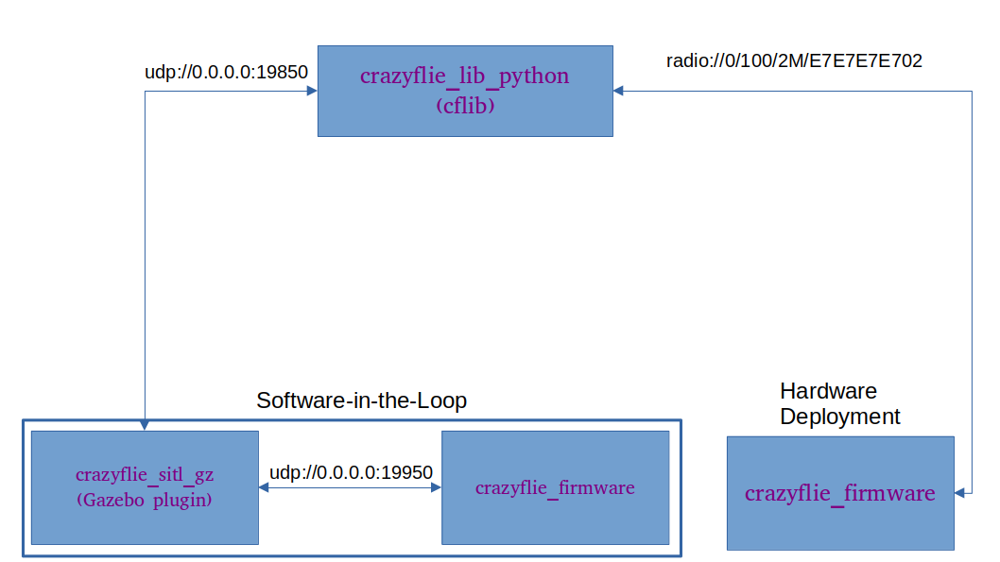

# Crazyflie Software-in-the-Loop Simulator Documentation

This repository contains a modified repository of the crazyflie firmware for software-in-the-loop support and interfaces with Gazebo Garden.

## Interface Diagram



## Building the code
First install Gazebo Garden from https://gazebosim.org/docs/garden/install_ubuntu

Run the command to build the firmware and Gazebo plugins.
```bash
mkdir -p sitl_make/build && cd $_
cmake ..
make all
```

## Spawn Models
Setup and spawning scripts are provided in the scripts folder.

Spawning a single crazyflie model with initial position (x = 0, y = 0)
```bash
bash tools/simulators/gz/sitl_singleagent.sh -m crazyflie -x 0 -y 0
```

Spawning 8 crazyflie models with to form a perfect square
```bash
bash tools/simulators/gz/sitl_multiagent_square.sh -n 8 -m crazyflie
```

Spawning multiple crazyflie models with positions defined in the *agents.txt* file. New vehicles are defined by adding a new line with comma deliminated initial position *x,y*.
```bash
bash tools/simulators/gz/sitl_multiagent_text.sh -m crazyflie
```